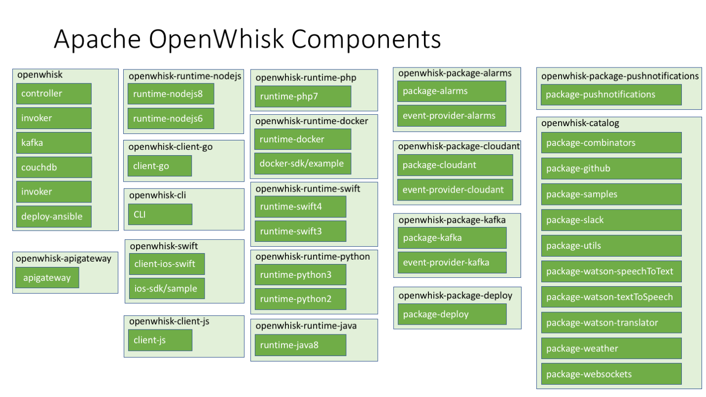

<!--
#
# Licensed to the Apache Software Foundation (ASF) under one or more
# contributor license agreements.  See the NOTICE file distributed with
# this work for additional information regarding copyright ownership.
# The ASF licenses this file to You under the Apache License, Version 2.0
# (the "License"); you may not use this file except in compliance with
# the License.  You may obtain a copy of the License at
#
#     http://www.apache.org/licenses/LICENSE-2.0
#
# Unless required by applicable law or agreed to in writing, software
# distributed under the License is distributed on an "AS IS" BASIS,
# WITHOUT WARRANTIES OR CONDITIONS OF ANY KIND, either express or implied.
# See the License for the specific language governing permissions and
# limitations under the License.
#
-->

# OpenWhisk

[](https://travis-ci.org/apache/incubator-openwhisk)
[](http://www.apache.org/licenses/LICENSE-2.0)
[](http://slack.openwhisk.org/)
[](https://codecov.io/gh/apache/incubator-openwhisk)
[](https://twitter.com/intent/follow?screen_name=openwhisk)

OpenWhisk is a cloud-first distributed event-based programming service. It provides a programming model to upload event handlers to a cloud service, and register the handlers to respond to various events. Learn more at [http://openwhisk.incubator.apache.org](http://openwhisk.incubator.apache.org).


* [Quick Start](#quick-start) (Docker-Compose)
* [Native development](#native-development) (Mac and Ubuntu)
* [Kubernetes](#kubernetes-setup)
* [Vagrant](#vagrant-setup)
* [Learn concepts and commands](#learn-concepts-and-commands)
* [Issues](#issues)
* [Slack](#slack)

### Quick Start
The easiest way to start using OpenWhisk is to get Docker installed on Mac, Windows or Linux. The [Docker website](https://docs.docker.com/install/) has detailed instructions on getting the tools installed. This does not give you a production deployment but gives you enough of the pieces to start writing functions and seeing them run.

```
git clone https://github.com/apache/incubator-openwhisk-devtools.git
cd incubator-openwhisk-devtools/docker-compose
make quick-start
```

For more detailed instructions or if you encounter problems see the [OpenWhisk-dev tools](https://github.com/apache/incubator-openwhisk-devtools/blob/master/docker-compose/README.md) project.

### Kubernetes Setup

Another path to quickly starting to use OpenWhisk is to install it on a Kubernetes cluster.  On a Mac, you can use the Kubernetes support built into Docker 18.06 (or higher). You can also deploy OpenWhisk on Minikube, on a managed Kubernetes cluster provisioned from a public cloud provider, or on a Kubernetes cluster you manage yourself. To get started,

```
git clone https://github.com/apache/incubator-openwhisk-deploy-kube.git
```

Then follow the instructions in the [OpenWhisk on Kubernetes README.md](https://github.com/apache/incubator-openwhisk-deploy-kube/blob/master/README.md).

### Vagrant Setup
A [Vagrant](http://vagrantup.com) machine is also available to run OpenWhisk on Mac, Windows PC or GNU/Linux but isn't used by as much of the dev team so sometimes lags behind.
Download and install [VirtualBox](https://www.virtualbox.org/wiki/Downloads) and [Vagrant](https://www.vagrantup.com/downloads.html) for your operating system and architecture.

**Note:** For Windows, you may need to install an ssh client in order to use the command `vagrant ssh`. Cygwin works well for this, and Git Bash comes with an ssh client you can point to. If you run the command and no ssh is installed, Vagrant will give you some options to try.

Follow these step to run your first OpenWhisk Action:
```
# Clone openwhisk
git clone --depth=1 https://github.com/apache/incubator-openwhisk.git openwhisk

# Change directory to tools/vagrant
cd openwhisk/tools/vagrant

# Run script to create vm and run hello action
./hello
```

Wait for hello action output:
```
wsk action invoke /whisk.system/utils/echo -p message hello --result
{
    "message": "hello"
}
```

These steps were tested on Mac OS X El Capitan, Ubuntu 14.04.3 LTS and Windows using Vagrant.
For more information about using OpenWhisk on Vagrant see the [tools/vagrant/README.md](tools/vagrant/README.md)

During the Vagrant setup, the Oracle JDK 8 is used as the default Java environment. If you would like to use OpenJDK 8, please change the line "su vagrant -c 'source all.sh oracle'" into "su vagrant -c 'source all.sh'" in tools/vagrant/Vagrantfile.

### Native development

Docker must be natively installed in order to build and deploy OpenWhisk.
If you plan to make contributions to OpenWhisk, we recommend either a Mac or Ubuntu environment.

* [Setup Mac for OpenWhisk](tools/macos/README.md)
* [Setup Ubuntu for OpenWhisk](tools/ubuntu-setup/README.md)

### Learn concepts and commands

Browse the [documentation](docs/) to learn more. Here are some topics you may be
interested in:

- [System overview](docs/about.md)
- [Getting Started](docs/README.md)
- [Create and invoke actions](docs/actions.md)
- [Create triggers and rules](docs/triggers_rules.md)
- [Use and create packages](docs/packages.md)
- [Browse and use the catalog](docs/catalog.md)
- [Using the OpenWhisk mobile SDK](docs/mobile_sdk.md)
- [OpenWhisk system details](docs/reference.md)
- [Implementing feeds](docs/feeds.md)
- [Developing a runtime for a new language](docs/actions-actionloop.md)

### Repository Structure

The OpenWhisk system is built from a [number of components](docs/dev/modules.md).  The picture below groups the components by their GitHub repos. Please open issues for a component against the appropriate repo (if in doubt just open against the main openwhisk repo).



### Issues

Report bugs, ask questions and request features [here on GitHub](../../issues).

### Slack

You can also join the OpenWhisk Team on Slack [https://openwhisk-team.slack.com](https://openwhisk-team.slack.com) and chat with developers. To get access to our public slack team, request an invite [https://openwhisk.incubator.apache.org/slack.html](https://openwhisk.incubator.apache.org/slack.html).
